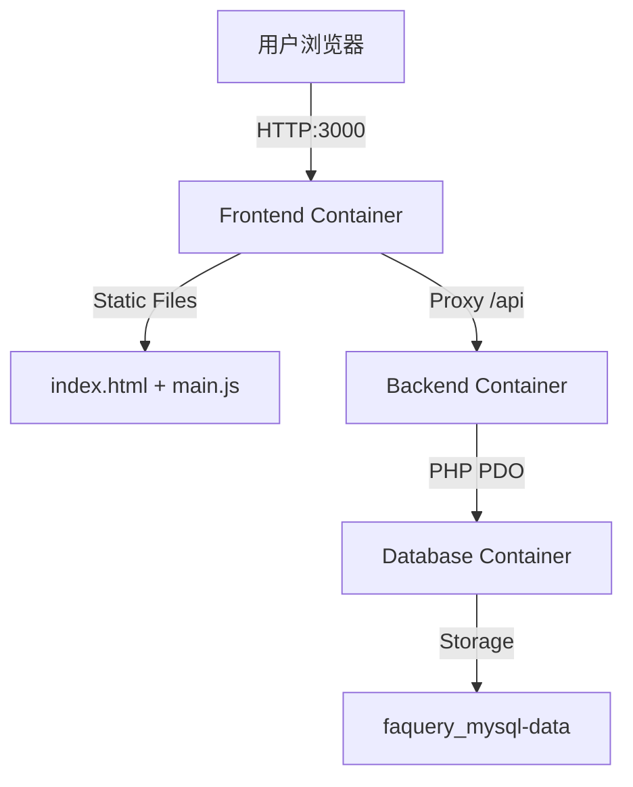

# FAQuery 系统架构文档

## 1. 架构概览

FAQuery 采用微服务风格的前后端分离架构，通过 Docker Compose 进行容器编排和部署。



## 2. 核心组件

### 2.1 Frontend (前端)
- **技术栈**: HTML5, Vanilla JavaScript (ES6+), Tailwind CSS (CDN/Local)。
- **职责**: 
  - 提供用户交互界面。
  - 处理表单验证 (JS-based, `novalidate`)。
  - 管理本地状态 (LocalStorage 存储连接配置和历史记录)。
  - 通过 Fetch API 调用后端接口。
- **容器**: 基于 `nginx:alpine`，仅仅托管静态文件并配置反向代理解决 CORS（开发环境）或路由转发。

### 2.2 Backend (后端)
- **技术栈**: PHP 8.2, Apache。
- **职责**:
  - 提供 RESTful API (`/api/query.php`)。
  - 动态解析前端传递的数据库连接参数（支持连接默认库或自定义外部库）。
  - 执行 SQL 查询并返回 JSON 结果。
  - 错误处理与标准化返回格式。
- **容器**: 基于 `php:8.2-apache`，安装 `pdo_mysql` 扩展。

### 2.3 Database (数据库)
- **技术栈**: MySQL 8.0。
- **职责**: 
  - 存储默认的固定资产数据。
  - 容器启动时自动执行 `/docker-entrypoint-initdb.d/init.sql` 初始化表结构和数据。
- **容器**: 基于 `mysql:8.0`。

## 3. 数据流

1. **配置阶段**: 用户在前端配置数据库连接信息，信息加密（Base64 或简单的 HTTP Header 传递，当前主要依靠 HTTPS 保障安全，Demo 环境为明文）存储在 LocalStorage。
2. **查询阶段**: 
   - 前端将 FACode 和 目标 DB 配置通过 HTTP Headers (`X-DB-HOST`, `X-DB-USER` 等) 发送给后端。
   - 后端解析 Header，动态构建 PHP PDO 连接。
   - 后端执行 `SELECT sn FROM assets WHERE facode = ?`。
   - 结果返回前端渲染。

## 4. 目录结构

```
FAQuery/
├── docker-compose.yml       # 服务编排
├── docs/                    # 项目文档
├── frontend/                # 前端代码
│   ├── src/main.js          # 核心业务逻辑
│   └── index.html           # 入口页面
├── backend/                 # 后端代码
│   ├── api/query.php        # 查询接口
│   └── config/database.php  # 数据库工具类
└── mysql-init/              # 数据库初始化脚本
```
