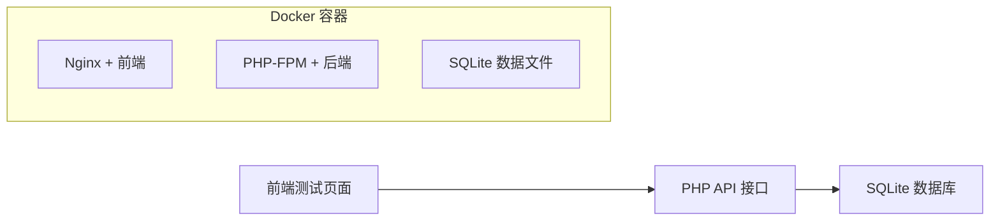

# FAQuery - 固定资产编码查询接口

## 项目概述

开发一个 PHP 接口项目，用于查询 SQLite 数据库中固定资产编码（FACode）对应的序列号（SN）。项目包含后端 API 和前端测试页面，完全容器化部署。

### 核心需求
1. **SQLite 数据库连接**：用户 `api`，密码 `FJzzCT#api`，数据库名 `fixed_assets`
2. **查询接口**：客户端发送 `facode`，返回对应的 `SN`（无数据返回 `null`）
3. **测试页面**：用户输入对端 IP，显示调用命令和返回值

---

## 用户确认事项

> [!IMPORTANT]
> 以下问题需要确认：

1. **SQLite 认证问题**：SQLite 是文件型数据库，原生不支持用户名/密码认证。请确认：
   - 数据库文件路径是什么？（例如 `/data/fixed_assets.db`）
   - 如果数据库已存在，请提供数据库文件
   - 如果需要创建新数据库，请确认 `facode2sn` 表的字段结构

2. **部署环境**：
   - 接口将部署在哪台服务器上？
   - 前端测试页面和后端 API 是否部署在同一服务器？

3. **示例数据**：
   - 是否需要预置一些测试数据？
   - 请提供 `facode` 和 `SN` 的数据格式示例

---

## 技术架构



### 技术栈

| 组件 | 技术选型 | 说明 |
|------|----------|------|
| 后端 | PHP 8 + PDO | 处理 API 请求和数据库查询 |
| 数据库 | SQLite | 轻量级文件数据库 |
| 前端 | HTML + Tailwind CSS | 现代 UI 测试页面 |
| 容器 | Docker + Nginx | 一键部署 |

---

## 提议的更改

### 项目目录结构

```
FAQuery/
├── README.md                 # 项目说明文档
├── docker-compose.yml        # Docker 编排配置
├── .gitignore                # Git 忽略配置
├── .dockerignore             # Docker 忽略配置
├── backend/                  # 后端代码
│   ├── Dockerfile
│   ├── nginx.conf            # Nginx 配置
│   ├── api/
│   │   └── query.php         # 查询接口
│   └── config/
│       └── database.php      # 数据库配置
├── frontend/                 # 前端代码
│   ├── Dockerfile
│   ├── nginx.conf
│   └── src/
│       └── index.html        # 测试页面
├── data/                     # 数据目录
│   └── fixed_assets.db       # SQLite 数据库文件
└── docs/                     # 文档目录
    └── api.md                # API 文档
```

---

### 后端 API 设计

#### [NEW] [query.php](file:///Users/jack.yan/Downloads/labeleases/student-hub/FAQuery/backend/api/query.php)

**接口说明**：

| 项目 | 描述 |
|------|------|
| 请求方式 | GET / POST |
| 端点 | `/api/query.php` |
| 参数 | `facode` (string) - 固定资产编码 |

**请求示例**：
```bash
curl "http://localhost:8080/api/query.php?facode=FA001"
```

**响应格式**：
```json
// 成功找到数据
{
    "success": true,
    "data": {
        "facode": "FA001",
        "sn": "SN20240101001"
    }
}

// 未找到数据
{
    "success": true,
    "data": null
}

// 参数错误
{
    "success": false,
    "error": "缺少 facode 参数"
}
```

**核心代码逻辑**：
```php
<?php
// 使用 PDO 预处理语句防止 SQL 注入
$stmt = $pdo->prepare("SELECT facode, sn FROM facode2sn WHERE facode = :facode");
$stmt->execute(['facode' => $facode]);
$result = $stmt->fetch(PDO::FETCH_ASSOC);

// 返回 JSON 响应
header('Content-Type: application/json; charset=utf-8');
echo json_encode([
    'success' => true,
    'data' => $result ?: null
]);
```

---

### 前端测试页面设计

#### [NEW] [index.html](file:///Users/jack.yan/Downloads/labeleases/student-hub/FAQuery/frontend/src/index.html)

**功能说明**：
1. **IP 地址输入**：用户输入后端 API 所在服务器的 IP 地址
2. **FACode 输入**：用户输入要查询的固定资产编码
3. **API 命令显示**：显示完整的 curl 调用命令
4. **返回值显示**：格式化显示 API 返回的 JSON 数据

**UI 设计要点**：
- 使用 Tailwind CSS 现代化设计
- 卡片式布局，圆角阴影
- 响应式设计，适配 PC 和移动端
- 加载状态提示（Spinner）
- 错误提示（Toast）

---

### Docker 容器化

#### [NEW] [docker-compose.yml](file:///Users/jack.yan/Downloads/labeleases/student-hub/FAQuery/docker-compose.yml)

```yaml
services:
  frontend:
    build: ./frontend
    ports:
      - "3000:80"
    depends_on:
      - backend
    networks:
      - app-network

  backend:
    build: ./backend
    ports:
      - "8080:80"
    volumes:
      - ./data:/app/data  # 挂载 SQLite 数据库
    networks:
      - app-network

networks:
  app-network:
    driver: bridge
```

---

## 验证计划

### 自动化测试

1. **API 接口测试**：
   ```bash
   # 测试有数据的情况
   curl "http://localhost:8080/api/query.php?facode=FA001"
   
   # 测试无数据的情况
   curl "http://localhost:8080/api/query.php?facode=NOTEXIST"
   
   # 测试缺少参数
   curl "http://localhost:8080/api/query.php"
   ```

2. **Docker 启动测试**：
   ```bash
   docker compose up --build
   ```

### 手动验证

1. **前端页面功能**：
   - 访问 `http://localhost:3000`
   - 输入 IP 地址和 FACode
   - 验证 API 命令显示正确
   - 验证返回值正确显示

2. **响应式设计**：
   - PC 端浏览器验证
   - 移动端模拟器验证

---

## 端口映射

| 服务 | 容器端口 | 宿主机端口 | 访问地址 |
|------|----------|------------|----------|
| 前端页面 | 80 | 3000 | http://localhost:3000 |
| 后端 API | 80 | 8080 | http://localhost:8080/api/query.php |
