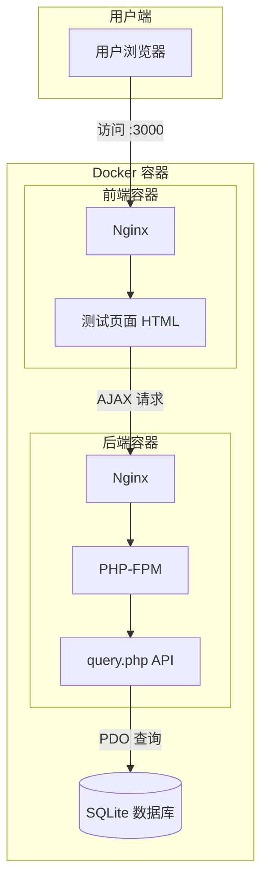

# FAQuery 项目逻辑梳理

## 项目概述

FAQuery 是一个固定资产编码查询系统，用于根据固定资产编码（FACode）查询对应的序列号（SN）。

---

## 系统架构



---

## 验证记录

### API 功能验证 (2026-01-24 12:30)

1. **查询存在的 FACode**
   - 测试数据：`FA001` -> `SN2024001`
   - CURL 结果：
     ```json
     {"success":true,"data":{"facode":"FA001","sn":"SN2024001"}}
     ```
   
2. **前端页面**
   - 访问 `http://localhost:3000`
   - HTTP 200 OK，页面加载成功
   - 文件大小：10811 字节，包含完整的 V3 UI

### 部署验证

- ✅ Docker 容器正常启动
- ✅ 数据库路径修复：修正了 `database.php` 中的相对路径问题
- ✅ 权限修复：`www-data` 用户拥有正确的文件写入权限
- ✅ V2 功能：历史记录存储到 localStorage
- ✅ V3 功能：数据库配置 Modal UI 已部署

### V3 功能说明

1. **界面数据库配置**
   - 点击右上角 ⚙️ 图标打开配置窗口
   - 支持切换 SQLite（默认）或 MySQL
   - 配置存储在浏览器 localStorage
   - 通过 HTTP Headers (`X-DB-*`) 实时传递配置到后端

2. **动态连接**
   - 后端优先读取请求头中的数据库配置
   - 支持运行时切换数据库类型
   - 无需重启容器即可切换连接
